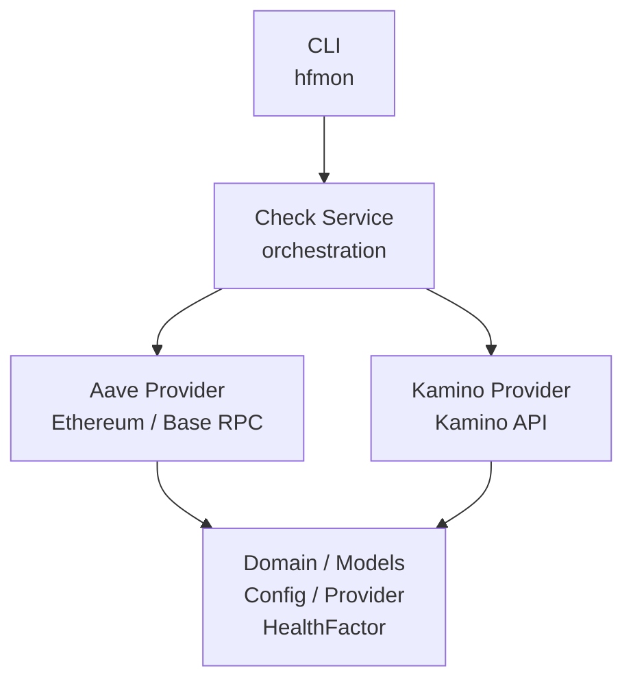

# Health Factor Monitor

**Monitor decentralized lending positions on Aave and Kamino directly from the terminal.**

A Go CLI for querying lending positions' Health Factors, ranking risk, and presenting results clearly — built with fault tolerance and an extensible provider architecture.

---

## 🎯 Problem

In the DeFi ecosystem, the Health Factor is a core metric to assess the risk of a credit position. In protocols such as Aave and Kamino, a position's health can change quickly due to market conditions, volatility, and leverage.

For users managing multiple positions across protocols, tracking this metric manually is slow and often affected by integration issues.

Health Factor Monitor solves this by providing a simple, automated experience to:

- Load positions configured in JSON;
- Validate required network entries and wallet address formats before execution;
- Query multiple protocols in a single flow;
- Display results in a readable terminal summary grouped by network;
- Maintain robustness even when some providers fail.

---

## 🚀 Delivered MVP

The MVP focuses on productivity and reliability.

### Current Features

- Support for Aave on Base and Ethereum Mainnet;
- Support for Kamino on Solana;
- Load and validate configuration from JSON;
- Validate RPC endpoint entries and wallet addresses;
- Visual Health Factor indicators rendered by the CLI:
  - 🟩 Safe: HF >= 1.50
  - 🟨 Attention: 1.10 <= HF < 1.50
  - 🟥 Critical: HF < 1.10
- Run checks per protocol or for all configured positions;
- Per-position fault tolerance;
- Terminal output with emoji indicators and Health Factor values;
- Exit status `0` when at least one position succeeds, or `1` when no position succeeds.

### How the Application Works

The CLI reads a configuration file, validates the provided data, and then queries each position using the corresponding provider. Configuration validation checks required fields, supported protocols and networks, wallet address formats, and whether an endpoint entry exists for each position's network. It does not probe endpoint availability before querying.

For Aave on Ethereum, the provider first queries the V3 contract and falls back to the V2 pool when V3 returns an effectively infinite health factor. For Kamino, the health factor is derived from portfolio LTV data and supply-only positions are ignored as they do not represent active debt.

If a position fails due to timeout, unavailable RPC/API, malformed response, or missing active debt, the rest of positions are still processed and the program continues running. HTTP requests use a 30-second client timeout.

### Architecture

The application is designed with a clear separation of concerns between domain, application, and infrastructure.



### Layers

- **Domain**: entities and business rules such as `Config`, `HealthFactor`, `ProviderResult`, and risk classification.
- **Application**: orchestrator responsible for mapping positions to providers and handling failures in a resilient way.
- **Infrastructure**: adapters for Aave and Kamino, plus the JSON configuration loader.
- **Interface**: CLI that renders a readable network-based summary with emoji indicators and defines exit status behavior.

### Main Contracts

The architecture follows a provider interface pattern, enabling the addition of new protocols without coupling service logic to concrete protocol implementations.

---

## Desenvolvimento Assistido por IA

Este projeto foi desenvolvido utilizando Desenvolvimento Orientado por Especificação (Spec-Driven Development — SDD), com o GitHub Spec Kit e o OpenCode como ferramentas de apoio ao desenvolvimento.

A IA foi utilizada como parte do processo de engenharia de software, não apenas como geradora de código. As decisões de produto, arquitetura e escopo foram definidas e revisadas humanamente antes e durante a implementação.

### 🧠 Fluxo de desenvolvimento

1. **Constitution** — definição dos princípios arquiteturais, tecnologias, restrições e diretrizes do projeto.
2. **Specification** — definição do problema, comportamento esperado, requisitos funcionais e valor de negócio.
3. **Planning** — definição da arquitetura, estrutura do projeto e decisões técnicas.
4. **Research** — investigação de APIs, protocolos, integrações e alternativas técnicas.
5. **Data Model & Contracts** — definição das entidades de domínio e contratos necessários.
6. **Task Breakdown** — decomposição do plano em tarefas pequenas e incrementais.
7. **Implementation** — implementação de uma tarefa por vez utilizando o OpenCode.
8. **Validation & Review** — execução de testes, análise estática e revisão da implementação.
9. **Commit** — versionamento de cada tarefa concluída.

### 🛠️ Ferramentas utilizadas

- **GitHub Spec Kit** — especificação e planejamento orientados por SDD.
- **OpenCode** — agente de IA utilizado durante a implementação e revisão do código.
- **Modelos de IA** — utilizados como agentes de desenvolvimento dentro do OpenCode.
- **Git/GitHub** — versionamento e gerenciamento do código.

### 👨‍💻 Human-in-the-loop

A implementação assistida por IA não substitui as decisões de engenharia.

O fluxo mantém participação humana em pontos importantes:

- Definição do problema e dos requisitos.
- Definição dos princípios arquiteturais.
- Escolha e revisão das decisões técnicas.
- Revisão dos artefatos gerados pelo Spec Kit.
- Validação das implementações produzidas pela IA.
- Investigação e correção de problemas.
- Revisão final antes dos commits.

O objetivo é utilizar IA para acelerar a execução e reduzir trabalho repetitivo, mantendo as decisões de engenharia, validação e responsabilidade técnica sob supervisão humana.

### 📚 Artefatos de especificação

Os artefatos utilizados durante o desenvolvimento são versionados no próprio projeto, permitindo acompanhar não apenas o código produzido, mas também as decisões e especificações que orientaram sua implementação.

```text
constitution.md
      ↓
spec.md
      ↓
plan.md
      ↓
research.md
      ↓
data-model.md
      ↓
contracts/
      ↓
tasks.md
      ↓
implementação
```

---

## 🛠️ Technology Stack

### Language and Runtime

- Go
- Terminal-first CLI

### Supported Protocols and Networks

- Aave on Ethereum Mainnet
- Aave on Base (Layer 2)
- Kamino on Solana

### Integrations and Formats

- JSON-RPC for Ethereum and Base
- REST API for Kamino
- Ethereum and Solana address validation
- JSON configuration loading
- Emoji-based Health Factor classification

### Tests

- Unit tests for the domain, providers, and service
- Validation of behavior in success, timeout, and error scenarios
- Coverage for classification rules, configuration, and failure recovery

---

## 🚀 How to Use

### 1. Configuration

Create a configuration file with positions and RPC endpoints.

```json
{
  "rpc_endpoints": {
    "ethereum": "https://ethereum-rpc.publicnode.com",
    "base": "https://mainnet.base.org",
    "solana": "https://api.mainnet-beta.solana.com"
  },
  "positions": [
    {
      "alias": "ethereum-borrower",
      "address": "0x168378977EDcB8B5c93025213e41cDD76e5EE058",
      "network": "base",
      "protocol": "aave"
    },
    {
      "alias": "solana-borrower",
      "address": "HX7qXRFZhgBFmJdE46BnsLEvtLdb14cBh1rMZiAA1x8C",
      "network": "solana",
      "protocol": "kamino"
    }
  ]
}
```

### 2. Install the CLI

Build and install the `hf` command in the Go binary directory:

```bash
make install
```

If the Go binary directory is not already in your `PATH`, add it to your shell configuration:

```bash
export PATH="$PATH:$(go env GOPATH)/bin"
```

### 3. Run

```bash
hf -config ./config.json
```

For development, the CLI can still be run from the source tree:

```bash
go run ./cmd/hfmon -config ./config.json
```

### 4. Example Output

```text
Health Factor
-------------
Base:	🟩 1.97
Solana:	🟩 2.22
```

The output uses the network name rather than the configured alias or protocol. A position without an active debt is rendered as `no active debt` only when the provider returns an effectively infinite Aave health factor; provider failures or missing active borrow records are shown as `HF: unavailable`.

### 5. Filter by Protocol

```bash
hf -config ./config.json -protocol aave
```

---

## 🧪 Validation and Robustness

The application is built with realistic operational failures:

- Invalid or unavailable RPC;
- Malformed provider response;
- Query timeout;
- Invalid address;
- Unsupported protocol;
- Missing configuration or required data.

When an item fails, the system continues processing the rest without crashing. The CLI prints the unavailable result but does not print the underlying provider error. If at least one result succeeds, the process exits with status `0`; otherwise it exits with status `1`.

---

## 📁 Project Structure

```text
cmd/
  hfmon/
internal/
  application/
  domain/
  infrastructure/
    aave/
    kamino/
    config/
interfaces/
  cli/
tests/
  integration/
  testdata/
specs/
```

---

## 📄 License

This project is licensed under the MIT License.
